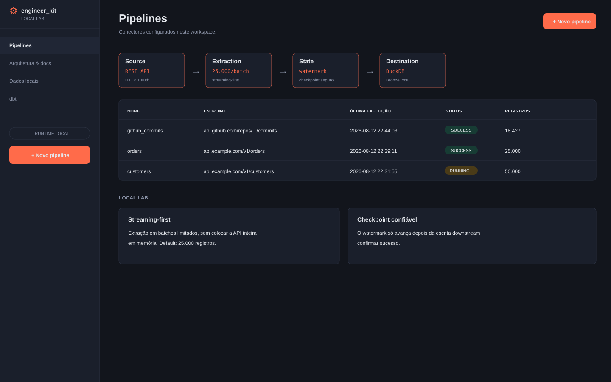
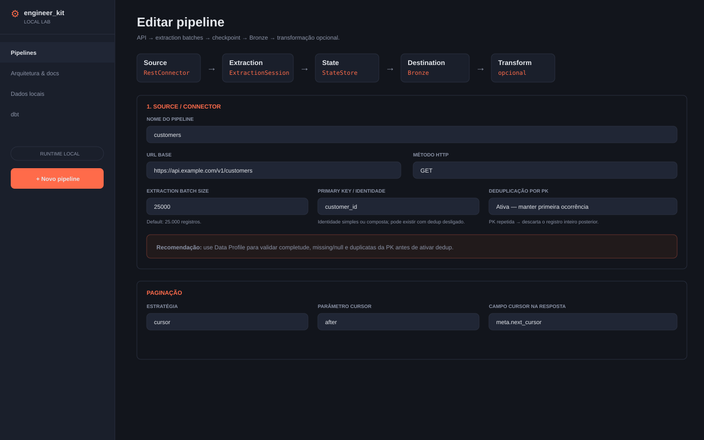
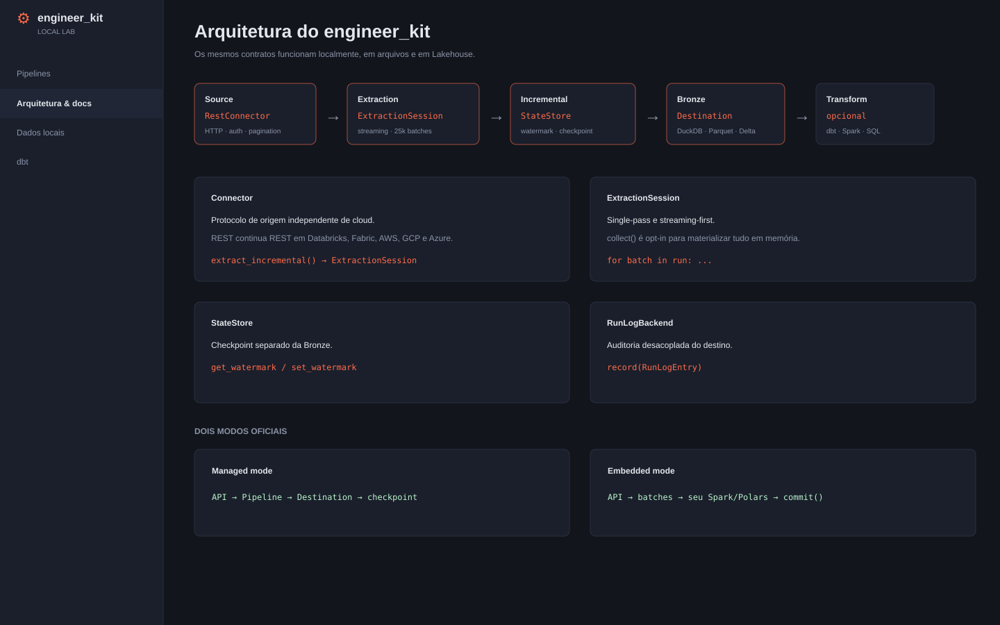

# engineer_kit

**🇧🇷 Português** · [🇺🇸 English](README.en.md)

> **Ingestão confiável de APIs REST para analytics — streaming-first, incremental e backend-agnostic.**

[](https://github.com/Lima-Ricardo/engineer_kit/actions/workflows/ci.yml)
[](https://lima-ricardo.github.io/engineer_kit/)
[](#instalação)
[](LICENSE)
[](SECURITY.md)

`engineer_kit` remove a parte repetitiva e perigosa de integrar APIs em pipelines de dados: HTTP, autenticação, paginação, retries, incremental, batching, checkpoint, schema drift e auditoria. A biblioteca pode **persistir a Bronze por você** ou simplesmente **entregar batches confiáveis para o seu código Spark/Pandas/Polars**.

```text
REST API
   │
   ▼
RestConnector ── HTTP / auth / retry / pagination
   │
   ▼
ExtractionSession ── streaming-first, 25.000 registros/batch por padrão
   │
   ├── embedded mode ──► seu código ──► Spark / Pandas / Polars / Arrow
   │
   └── managed mode  ──► Destination ──► DuckDB / Parquet / Delta
                              │
                              ▼
                         checkpoint seguro
```

## 📰 Notícias do projeto

### v0.1.0 — release candidate pública

A release candidate 0.1.0 consolida a mudança de um pipeline centrado em DuckDB para um toolkit de ingestão **backend-agnostic e streaming-first**:

- `Connector` e `ExtractionSession` independentes de plataforma;
- batches de extração com default de **25.000 registros**;
- checkpoint explícito e seguro no embedded mode;
- `StateStore`, `Destination` e `RunLogBackend` desacoplados;
- adapters oficiais para **DuckDB, Parquet e Delta Lake**;
- uso direto dentro de **Databricks e Microsoft Fabric**;
- segurança por padrão em HTTP, secrets, YAML, filesystem, logs e UI;
- local lab visual para aprender, configurar e inspecionar pipelines;
- CI em Python 3.10/3.11/3.12, segurança, packaging e stress sintético.

Acompanhe detalhes e mudanças em [`CHANGELOG.md`](CHANGELOG.md) e na [documentação completa em português](https://lima-ricardo.github.io/engineer_kit/). A [documentação em inglês](https://lima-ricardo.github.io/engineer_kit/en/) mantém a mesma estrutura e exemplos.

## 📸 Local Lab / UI

A UI é opcional e serve como laboratório local para criar pipelines, entender os contratos e acompanhar execuções.

### Dashboard



### Editor visual de pipeline



### Arquitetura e contratos



### Execução e logs


> As imagens usam dados demonstrativos, mas representam a interface e o fluxo do local lab.

## 🚀 Instalação

O core é leve e não instala DuckDB, PyArrow, Delta, dbt ou UI automaticamente.

```bash
pip install engineer_kit
```

Escolha somente os extras necessários:

```bash
pip install "engineer_kit[duckdb]"    # DuckDB local
pip install "engineer_kit[parquet]"   # Parquet / PyArrow
pip install "engineer_kit[delta]"     # Delta Lake / delta-rs
pip install "engineer_kit[platform]"  # perfil Lakehouse
pip install "engineer_kit[ui]"        # interface local
pip install "engineer_kit[dbt]"       # dbt-duckdb
pip install "engineer_kit[local]"     # DuckDB + UI + dbt
pip install "engineer_kit[all]"       # tudo
```

O mesmo pacote funciona com `pip`, `pipx`, `uv`, Poetry e outros instaladores que consomem o índice PyPI.

## ⚡ Primeiro uso: extração streaming-first

O caminho recomendado não coloca a resposta completa da API em memória:

```python
from datetime import date

from engineer_kit import (
    IncrementalMode,
    NoPagination,
    RestConnector,
)

connector = RestConnector(
    name="customers",
    base_url="https://api.example.com/customers",
    pagination=NoPagination(),
    method="GET",
    incremental_mode=IncrementalMode.INGESTION_DATE,
    initial_start=date(2026, 1, 1),
)

run = connector.extract_incremental()

for batch in run:  # default: até 25.000 registros por batch
    process(batch)

run.commit()
```

`collect()` existe, mas é uma escolha explícita para datasets pequenos:

```python
records = connector.extract_incremental().collect()
```

## 🧠 Três tamanhos que não devem ser confundidos

```text
API page size
     ↓
Extraction batch size       default: 25.000
     ↓
Destination write batch     adapter-specific
```

Se a API devolve 1.000 registros por página, um batch de extração pode ser formado depois de aproximadamente 25 páginas. Isso é apenas uma consequência prática; **paginação e batching continuam independentes**.

## 🔐 Autenticação e secrets

### Produção: arquivo ou ambiente

```python
from engineer_kit import BearerAuth, FileSecretProvider

secrets = FileSecretProvider("/run/secrets")
auth = BearerAuth(secrets, "API_TOKEN")
```

Ou use `EnvSecretProvider`.

### Estudo e laboratório: hardcoded explícito

```python
from engineer_kit import BearerAuth, StaticSecretProvider

secrets = StaticSecretProvider({"API_TOKEN": "training-only-token"})
auth = BearerAuth(secrets, "API_TOKEN")
```

Hardcoded é suportado deliberadamente para aprendizado e testes descartáveis. Para credenciais reais, prefira arquivo, variável de ambiente, workload identity ou um `SecretProvider` integrado ao secret manager da plataforma.

## 📄 Paginação suportada

| Estratégia | Classe | Exemplo típico |
|---|---|---|
| sem paginação | `NoPagination` | endpoint pequeno |
| página | `PageNumberPagination` | `?page=2&per_page=1000` |
| offset | `OffsetPagination` | `?offset=1000&limit=1000` |
| cursor | `CursorPagination` | `next_cursor` no JSON |
| Link header | `LinkHeaderPagination` | GitHub / RFC 5988 |
| próxima URL | `NextUrlPagination` | `{"next": "https://..."}` |

Para formatos incomuns, implemente `PaginationStrategy`.

## 🧩 Dois modos oficiais

### Managed mode

Use quando a própria biblioteca deve persistir a Bronze e confirmar o checkpoint:

```text
API → Pipeline → Destination → StateStore → RunLogBackend
```

Adapters oficiais:

| Uso | Destination | State | Audit |
|---|---|---|---|
| local | `DuckDBDestination` | `DuckDBStateStore` | `DuckDBRunLogStore` |
| arquivos | `ParquetDestination` | `JsonFileStateStore` | `JsonLinesRunLogStore` |
| Lakehouse | `DeltaDestination` | `DeltaStateStore` | `DeltaRunLogStore` |

### Embedded mode

Use quando você está dentro de Databricks, Fabric ou outro runtime e quer que o `engineer_kit` cuide somente de API + paginação + incremental:

```python
run = connector.extract_incremental()

for batch in run:
    df = spark.createDataFrame(batch)
    df = transform(df)
    persist(df)

run.commit()  # só depois do downstream terminar com sucesso
```

O watermark não deve avançar antes da persistência downstream.

## 🧱 Bronze estável por design

A Bronze prioriza **captura confiável** em vez de inferência agressiva de schema:

- campos declarados são persistidos como `string/null` nos adapters oficiais;
- tipos analíticos são lógicos e aplicados no staging/transformação;
- `_raw` preserva o registro original;
- campos inesperados vão para `_extra`;
- `_run_id`, `_window_start`, `_window_end` e `_ingestion_key` dão rastreabilidade e retry seguro.

## 📝 Pipeline declarativo em YAML

```yaml
name: orders

connector:
  base_url: https://api.example.com/v1/orders
  method: GET
  extraction_batch_size: 25000
  max_pages: 10000
  auth:
    type: bearer
    secret_key: API_TOKEN
  pagination:
    type: page
    params:
      page_param: page
      page_size_param: per_page
      page_size: 1000
  incremental:
    mode: data_date
    initial_start: "2026-01-01"
    date_field: updated_at
  date_params:
    start: updated_from
    end: updated_to
    format: "%Y-%m-%d"

columns:
  - name: id
    dtype: bigint
  - name: updated_at
    dtype: timestamp

destination:
  type: parquet
  path: ./lake
  schema: bronze
  batch_size: 5000
  write_mode: append

state:
  type: auto

run_log:
  enabled: true
  type: auto

secrets:
  type: env

transform:
  type: none
```

Execute:

```bash
engineer_kit run-config pipelines/orders.yaml
```

## 🖥️ Local Lab

```bash
pip install "engineer_kit[local]"
engineer_kit ui --workspace .
```

Por padrão a UI é local/loopback, protegida por autenticação e projetada para desenvolvimento e treinamento. Veja o guia completo de UI antes de expor remotamente.

## ☁️ Databricks, Fabric, AWS, Google Cloud e Azure

Cloud é runtime/storage, não tipo de connector. Uma REST API continua sendo `RestConnector` em qualquer ambiente.

```text
Source layer
└── RestConnector

Runtime / storage
├── local → DuckDB / Parquet
├── Databricks → Spark / Delta
├── Microsoft Fabric → Spark / OneLake / Delta
├── AWS → S3 / Delta
├── Google Cloud → GCS / Delta
└── Azure → ADLS / OneLake / Delta
```

Isso evita classes artificiais como `AWSRestConnector` ou `FabricRestConnector` quando o protocolo de origem é o mesmo.

## 🛡️ Segurança por padrão

A biblioteca inclui proteções de runtime e de supply chain:

- HTTPS obrigatório por padrão e TLS verificado;
- redaction de secrets em logs e erros;
- respostas HTTP limitadas em tamanho antes do parse;
- redirect e paginação cross-origin bloqueados por padrão;
- bloqueio de alvos link-local/metadata;
- retry de POST somente com opt-in;
- proteção contra header injection;
- YAML com `safe_load`, limite de tamanho e política contra secrets inline;
- proteção contra traversal/symlink em secrets de arquivo;
- UI com security headers e controles same-origin;
- dbt com `shell=False`, timeout e redaction;
- CI com Ruff, Bandit, `pip-audit`, `pip check`, property tests e stress.

Leia [`SECURITY.md`](SECURITY.md) antes de colocar a biblioteca em produção.

## ✅ O que é testado

O CI cobre:

- Python 3.10, 3.11 e 3.12;
- instalação core-only sem backends opcionais;
- DuckDB, Parquet e Delta;
- paginação, incremental, checkpoint e retry idempotente;
- embedded e managed mode;
- CLI, YAML e UI;
- segurança e property-based tests;
- build de wheel/sdist;
- stress sintético: DuckDB 250k, Parquet 250k, Delta 100k registros.

## 📚 Documentação

A documentação completa em português fica no GitHub Pages:

**https://lima-ricardo.github.io/engineer_kit/**

A versão completa em inglês fica em:

**https://lima-ricardo.github.io/engineer_kit/en/**

Atalhos:

- [Começando do zero](https://lima-ricardo.github.io/engineer_kit/getting-started/installation/)
- [Primeiro pipeline](https://lima-ricardo.github.io/engineer_kit/getting-started/first-pipeline/)
- [Autenticação e secrets](https://lima-ricardo.github.io/engineer_kit/guides/authentication/)
- [Paginação](https://lima-ricardo.github.io/engineer_kit/guides/pagination/)
- [Incremental e watermark](https://lima-ricardo.github.io/engineer_kit/guides/incremental/)
- [Streaming e batching](https://lima-ricardo.github.io/engineer_kit/guides/streaming/)
- [Databricks e Fabric](https://lima-ricardo.github.io/engineer_kit/guides/embedded-mode/)
- [Referência YAML](https://lima-ricardo.github.io/engineer_kit/reference/configuration/)
- [Troubleshooting](https://lima-ricardo.github.io/engineer_kit/reference/troubleshooting/)

## 🧪 Desenvolvimento

```bash
git clone https://github.com/Lima-Ricardo/engineer_kit.git
cd engineer_kit
python -m venv .venv
source .venv/bin/activate  # Windows: .venv\Scripts\activate
pip install -e ".[dev,all,docs]"
pytest -q
mkdocs serve
```

Para servir a documentação em inglês localmente:

```bash
mkdocs serve -f mkdocs.en.yml
```

## 🤝 Contribuição

Issues, documentação e PRs são bem-vindos. Leia [`CONTRIBUTING.md`](CONTRIBUTING.md) antes de contribuir.

## 🔒 Reportar vulnerabilidade

Não publique tokens, exploits ou dados sensíveis em issue pública. Siga [`SECURITY.md`](SECURITY.md).

## 📜 Licença

MIT — veja [`LICENSE`](LICENSE).
