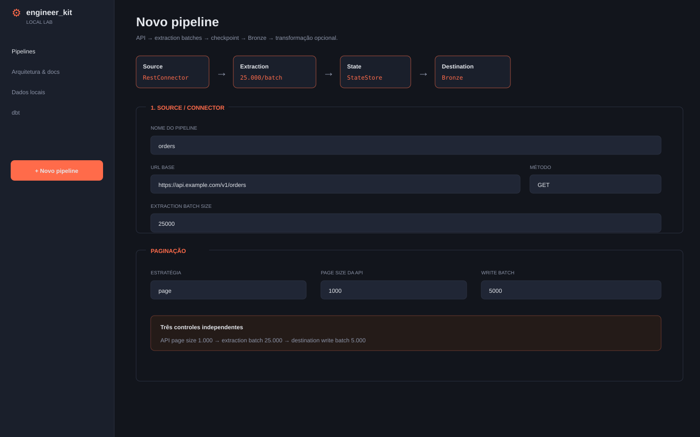
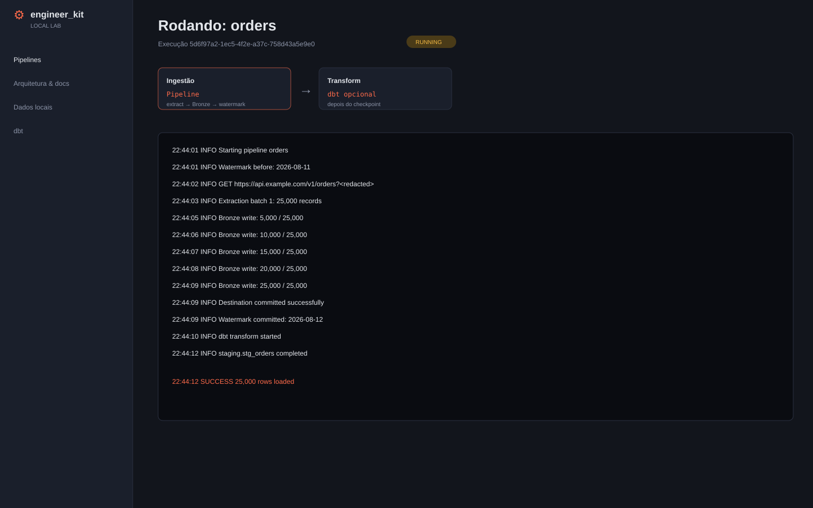

# Local Lab / UI

The UI is a development and training lab. It visualizes the same contracts used by the Python API and YAML configuration.

## Installation

```bash
pip install "engineer_kit[local]"
```

## Start the lab

```bash
engineer_kit ui --workspace .
```

The CLI generates a temporary password when necessary and binds to loopback by default.

## Dashboard


The dashboard shows pipelines, latest execution, status, and record counts.

## Editor



The form separates source/connector, extraction batch, authentication, pagination, incremental state, schema, destination, transformation, and audit.

## Architecture


The architecture page explains managed/embedded modes and the available adapters.

## Logs



The execution page streams logs and redacts sensitive text before display/persistence.

## Remote exposure

Do not treat the Local Lab as a multi-tenant product. If you must bind outside loopback, explicitly opt in, use strong credentials, terminate TLS at a reverse proxy, restrict the source network, avoid workspaces containing real hardcoded secrets, and apply OS/container controls.
